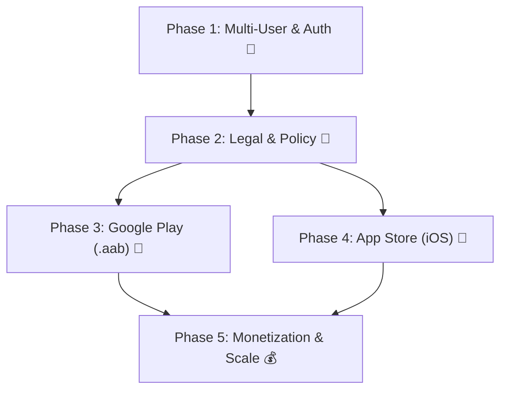

# 🦉 Owl Trading Journal - Store Launch & Commercial Roadmap
> **แผนงานและคู่มือการเตรียมตัวนำ Owl Trading Journal ขึ้นขายบน Google Play Store & Apple App Store**

---

## 📌 ภาพรวมโปรเจกต์ (Project Overview)
* **ชื่อแอป (App Name)**: `Owl Trading Journal` (Short Name: `Owl Trader`)
* **Mascot / Icon**: นกฮูกสไตล์ 8-Bit Pixel Art ถือสมุดเทรดและกระดานกราฟ
* **จุดขายหลัก (USP)**:
  * Gamified Retro 8-Bit RPG Interface
  * Real-Time Daily Drawdown (DD) & Retro HP Life Bar
  * Max Consecutive Loss Brain Cooldown (2-Hour Rest Lock)
  * AI Export Pipeline (Agent_Shark & Agent_Bee compatible)
  * Multi-Device Real-Time Cloud Sync

---

## 🗺️ แผนงาน 5 ขั้นตอนสู่การเปิดตัวบน Store (5-Phase Roadmap)



---

### 🔹 Phase 1: ระบบ Multi-User & Data Isolation (ความปลอดภัยระดับพาณิชย์)
- [ ] **ระบบเข้าสู่ระบบ (Authentication)**:
  - เพิ่มปุ่ม `Sign in with Google` (และ `Sign in with Apple` สำหรับ iOS)
- [ ] **แยกพื้นที่เก็บข้อมูลรายบุคคล (Database Sandbox)**:
  - ปรับโครงสร้าง Firebase จาก Shared Path ไปเป็น `/users/{uid}/...`
    ```json
    {
      "users": {
        "<UID>": {
          "profile": { "email": "trader@example.com", "tier": "free" },
          "balances": { "Demo": 10000, "Real": 1000 },
          "trades": [ ... ],
          "cfs": [ ... ],
          "settings": { "maxDailyDD": 5.0 }
        }
      }
    }
    ```
- [ ] **Firebase Security Rules**:
  - ล็อกสิทธิ์ให้อ่าน/เขียนได้เฉพาะเจ้าของ UID เท่านั้น (`auth.uid == $uid`)
- [ ] **ปุ่มลบบัญชีและข้อมูล (Account Deletion)**:
  - เพิ่มปุ่ม *"ลบบัญชีและล้างประวัติทั้งหมด"* ในหน้า Settings (กฎบังคับของ Apple & Google)

---

### 🔹 Phase 2: เอกสารทางกฎหมาย & หน้านโยบาย (Legal & Compliance)
- [ ] **Privacy Policy (นโยบายความเป็นส่วนตัว)**:
  - สร้างหน้าเว็บ `privacy.html` ชี้แจงการเก็บข้อมูล (อีเมล, บันทึกการเทรด)
  - นำลิงก์ไปแปะใน Google Play Console, App Store Connect และหน้า Settings ในแอป
- [ ] **Terms of Service (เงื่อนไขการใช้งาน)**:
  - ข้อความปฏิเสธความรับผิดชอบทางการเงิน (Disclaimer: *แอปนี้เป็นเครื่องมือจดบันทึกและสถิติ ไม่ใช่คำแนะนำทางการเงิน*)

---

### 🔹 Phase 3: การขึ้น Google Play Store (Android)
* **ค่าธรรมเนียม**: $25 (ประมาณ 870 บาท จ่ายครั้งเดียวตลอดชีพ)
* **สิ่งที่ต้องเตรียม**:
  - [ ] สมัครบัญชี **Google Play Console**
  - [ ] สร้าง **Release Keystore** สำหรับเซ็นชื่อดิจิทัลของแอป
  - [ ] รันคำสั่ง Build เป็นไฟล์ **Android App Bundle (`.aab`)**:
    ```bash
    ./gradlew bundleRelease
    ```
  - [ ] **Closed Testing (14 วัน)**: นำไฟล์ `.aab` เข้าทดสอบใน Closed Track กับผู้ทดสอบอย่างน้อย 12 คน ติดต่อกัน 14 วัน
  - [ ] **Store Assets**:
    - App Icon: 512x512 PNG (รูปโลโก้นกฮูก)
    - Feature Graphic: 1024x500 PNG
    - Screenshots: ภาพหน้าจอแอปขนาด 16:9 / 9:16 (หน้า Hub, หน้า Log, หน้า Stats)

---

### 🔹 Phase 4: การขึ้น Apple App Store (iOS)
* **ค่าธรรมเนียม**: $99 / ปี (ประมาณ 3,500 บาท ต่อปี)
* **สิ่งที่ต้องเตรียม**:
  - [ ] สมัคร **Apple Developer Program**
  - [ ] เครื่อง Mac และโปรแกรม Xcode ในการ Build & Archive
  - [ ] ฝังระบบ **Sign in with Apple** (ข้อบังคับถ้ามี Google Sign-In)
  - [ ] แคปเจอร์ภาพหน้าจอ iPhone ขนาด 6.7" และ 6.5" และ iPad

---

### 🔹 Phase 5: โมเดลการสร้างรายได้ (Monetization Strategy)

| ฟีเจอร์ / สิทธิ์การใช้งาน | 🟢 Free Tier (ทุกคนใช้ได้) | 👑 Owl Pro Tier (สมาชิก/ซื้อขาด) |
| :--- | :---: | :---: |
| **บันทึกการเทรด** | ไม่จำกัด (เก็บบนเครื่อง) | ไม่จำกัด |
| **Daily Drawdown HP Bar** | ✅ มี | ✅ มี |
| **2-SL Brain Cooldown Lock** | ✅ มี | ✅ มี |
| **Cloud Real-Time Sync ข้ามเครื่อง** | ❌ | 🚀 **ซิงก์อัตโนมัติ Mobile ⇄ PC** |
| **AI Analysis CSV Export** | พื้นฐาน | 🤖 **พร้อมสูตรและจัดฟอร์แมตขั้นสูง** |
| **แนบภาพกราฟก่อน/หลังเทรด** | ❌ | 📸 **เก็บรูปภาพกราฟบน Cloud Storage** |
| **Custom 8-Bit Themes** | Retro Blue มาตรฐาน | 🎨 **ปลดล็อก Gameboy, Cyberpunk, Gold** |

---

## 🛠️ เครื่องมือและคำสั่งสำหรับเริ่มต่อยอดทันทีเมื่อพร้อม
เมื่อต้องการเริ่มทำ Phase 1 เพียงแจ้ง Agent ว่า:
> *"เริ่มทำ Phase 1: เพิ่มระบบ Sign-in with Google และจัดโครงสร้าง Database Multi-User ตามแผนใน STORE_LAUNCH_ROADMAP.md"*
